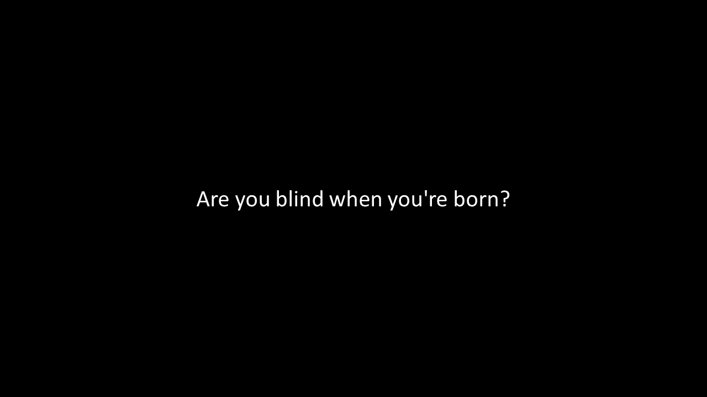
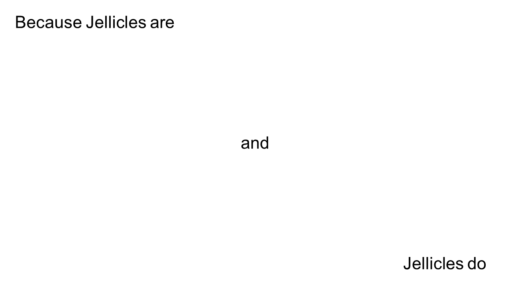

# HW06 Notes
This week's assignment is to draw with text. The text I picked is lyrics from [**Cats**](https://www.allmusicals.com/lyrics/cats/prologuejelliclesongsforjelliclecats.htm). **Cats** is a musical written by Andrew Lloyd Webber, and is one of my favorite musicals. Its world premiere was at the New London Theatre in 1981. 

I called my project a visual musical because my goal is to visualize the musical performance with pure text animation. My main focus is the rhythms and meaning of the text, which are transformed into the pace of the animation and the text color. 

## Ideation
For this project, since it only involves text, I used PowerPoint slides to do sketching. Below are some of the sketches. You may also find the [slides](./HW06Sketches.pptx) in this repository. 

For the first part of the animation (slides 1 to 9), I want the words to print out one by one. For the second part, since the lyrics form groups of 3 lines, I want to put 3 lines on the canvas one by one for each group. 

## Implementation
