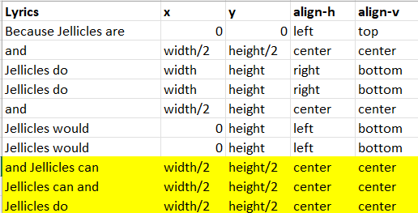

# HW06 Notes
This week's assignment is to draw with text. The text I picked is lyrics from [**Cats**](https://www.allmusicals.com/lyrics/cats/prologuejelliclesongsforjelliclecats.htm). **Cats** is a musical written by Andrew Lloyd Webber, and is one of my favorite musicals. Its world premiere was at the New London Theatre in 1981. 

I called my project a visual musical because my goal is to visualize the musical performance with pure text animation. My main focus is the rhythms and meaning of the text, which are transformed into the pace of the animation and the text color. 

## Ideation
For this project, since it only involves text, I used PowerPoint slides to do sketching. Below are some of the sketches. You may also find the [slides](./HW06Sketches.pptx) in this repository. 

For the first part of the animation (slides 1 to 9), I want the words to print out one by one. For the second part, since the lyrics form groups of 3 lines, I want to put 3 lines on the canvas one by one for each group. The viewer can interact with the screen by mouse clicks. After one animation, the viewer needs to click the mouse to see the next animation. 

## Implementation
### Initialization
To start with, the code initializes a `lineIndex` variable, which stores the index of the current line to animate. The mouse interaction is handled by the `mouseClicked()` function written at the end of the code. 

The lyrics I use are saved in a .txt file named lyrics.txt. They are separated into several lines so that it is easy to process them later with codes. The .txt file is preloaded by the `preload()` function. 

In the `setup()` function, I initialized text-related properties like text font and text size. I also set the frame rate to 4, because I want to use it for animation speed control. 

### Part 1
First, the `draw()` function gets the `currentLine` to animate from the .txt file. Then, the first part of the animation is achieved by the `printLine1` function. In this function, a `bgColorList` and a `textColorList` are preset for each line in part 1 animation. Then, the current line is split into a list of words and animated out one by one at the rate of 4 words per second (same as the frame rate). When all the words in the current line are printed out, the text stays on the canvas and waits for a mouse click from the viewer. 

### Part 2
This part is a bit difficult for me and I spent most of my time on its logic. Different from the first part, I want lines in this part printed out one by one in groups of 3. Also, the animation should wait for the viewer's mouse to click upon animating each group of 3 lines. 

My solution is to use an if-else statement: if `lineIndex % 3 == 0`, then only print the current line; else if `lineIndex % 3 == 1`, then print the current line and its previous line; else (lineIndex % 3 == 2), print the current line and the line previous to its previous line. 

Since I wanted to alter the style of the lines, I created a `StylizedLine` class with a `draw()` function. In this way, all the properties of text and background styles are handled by the `StylizedLine` class and I could focus on the logic in the main `draw()` function. 

Moreover, the speeds of the two parts of animation should be different. In the musical, the first part of the lyrics has more words compared with the second part in the same length of time. Therefore, I added another if statement (`if (frameCount%2 == 0)`) outside of the if-else statement for animation. In this way, I slow down the second part of the animation by updating the canvas once for every two frames. 

Since I was focusing on the animation logic, I simplified the position of each line in a group. The initial plan had each 3 lines positioned without a clear pattern, so I changed them to the pattern of top-center-bottom. 

Below is a summary of the initial plan of line positioning. 

## Conclusion
Drawing with text is an interesting experience. However, I find it less straightforward than pure shapes because it requires string manipulation. 

For the logic of the second part of the animation, I see the repetitive patterns but haven't figured out how to simplify them. Maybe they can be simplified into a for loop. I will update my codes once I figure it out. 
